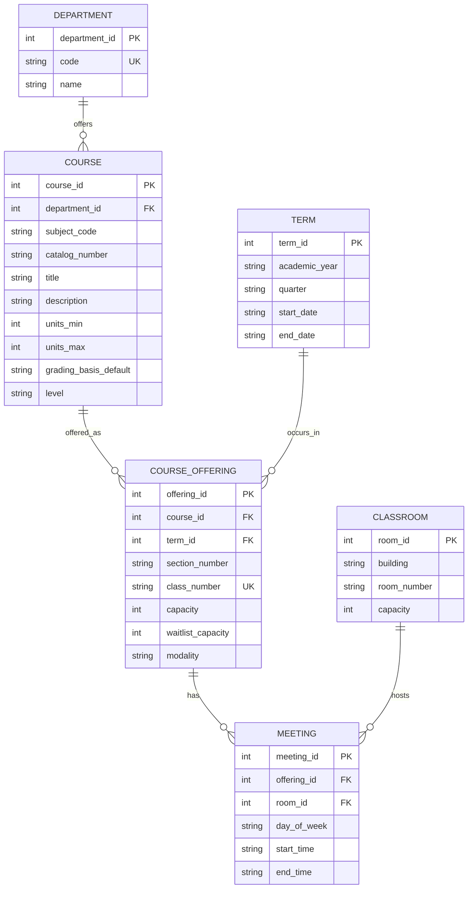
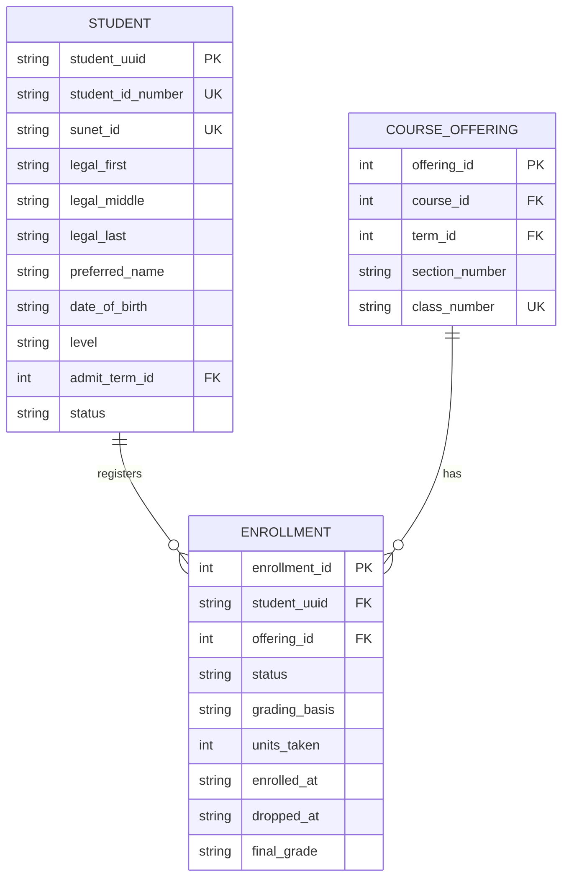
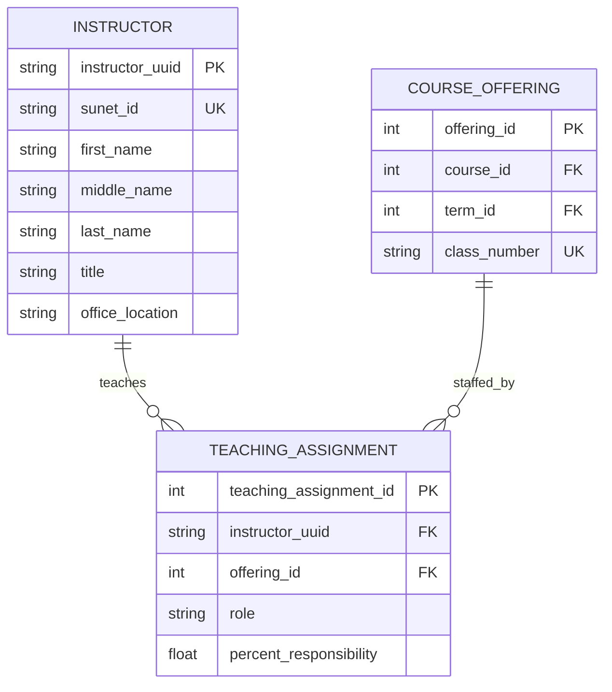
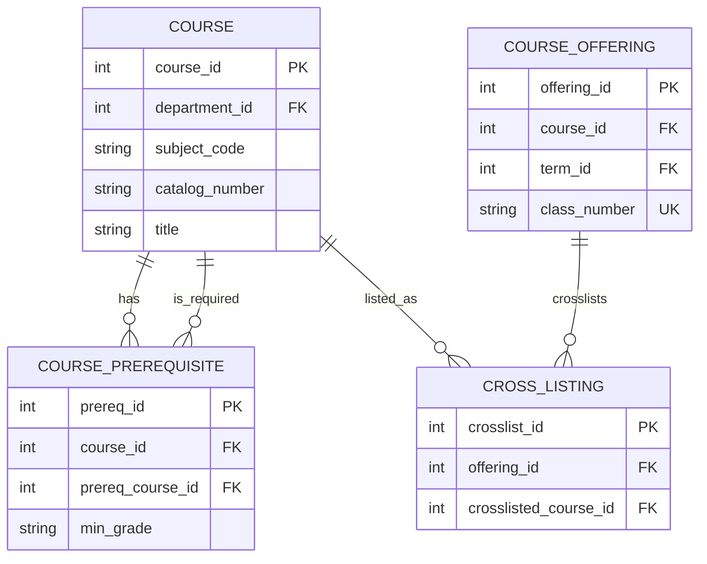
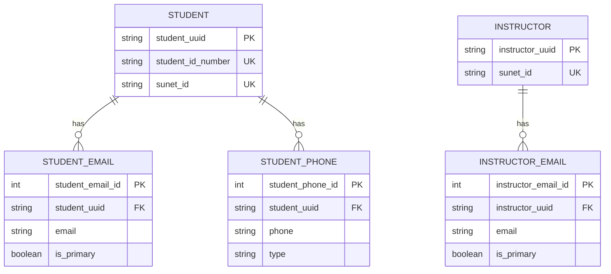

# University Course Management System — ERD

---
## 1) Entities & Attributes (with attribute types)

Legend:
- **PK** = Primary Key
- **AK** = Alternate Key / Unique Identifier
- **(C)** = Composite attribute
- **(M)** = Multivalued attribute *(modeled as separate entity/table)*
- **(D)** = Derived attribute

### 1.1 Core academic structure

| Entity | Primary Key | Alternate keys / unique IDs | Selected attributes | Notes (C/M/D) |
|---|---|---|---|---|
| Department | department_id | code | name, chair_instructor_id (FK) | — |
| Course (Catalog) | course_id | (subject_code, catalog_number) *(candidate AK)* | department_id (FK), title, description, units_min, units_max, grading_basis_default, level | — |
| Term | term_id | — | academic_year, quarter, start_date, end_date | — |
| CourseOffering / Section | offering_id | class_number | course_id (FK), term_id (FK), section_number, capacity, waitlist_capacity, modality, enrolled_count, waitlist_count | enrolled_count **(D)**, waitlist_count **(D)** |
| Classroom | room_id | (building, room_number) *(candidate)* | capacity | — |
| Meeting | meeting_id | — | offering_id (FK), room_id (FK, optional), day_of_week, start_time, end_time | room optional for online/hybrid |

### 1.2 People

| Entity | Primary Key | Alternate keys / unique IDs | Selected attributes | Notes (C/M/D) |
|---|---|---|---|---|
| Student | student_uuid | student_id_number; sunet_id | legal_name, preferred_name, date_of_birth, age, level, admit_term_id (FK, optional), status | legal_name **(C)**; emails/phones **(M)**; age **(D)** |
| Instructor | instructor_uuid | sunet_id | name, title, office_location | name **(C)**; emails **(M)** |

### 1.3 Relationship / associative entities (M:N resolution)

| Associative entity | Primary Key | Foreign Keys | Relationship captured | Relationship attributes / notes |
|---|---|---|---|---|
| Enrollment | enrollment_id | student_uuid → Student; offering_id → CourseOffering | Student **M:N** CourseOffering | status (enrolled/waitlisted/dropped), grading_basis, units_taken, enrolled_at, dropped_at, final_grade; rule: unique (student_uuid, offering_id) |
| TeachingAssignment | teaching_assignment_id | instructor_uuid → Instructor; offering_id → CourseOffering | Instructor **M:N** CourseOffering | role (instructor_of_record/co-instructor/TA), percent_responsibility |
| CoursePrerequisite | prereq_id | course_id → Course; prereq_course_id → Course | Course **M:N** Course (self) | min_grade; rule: course_id != prereq_course_id |
| CrossListing | crosslist_id | offering_id → CourseOffering; crosslisted_course_id → Course | Offering **M:N** Course | optional: used for cross-listed offerings |

### 1.4 Multivalued attribute entities (examples)

| Entity (multivalued attribute table) | Primary Key | Foreign Keys | Attributes | Notes |
|---|---|---|---|---|
| StudentEmail | student_email_id | student_uuid → Student | email, is_primary | models Student.emails **(M)** |
| StudentPhone | student_phone_id | student_uuid → Student | phone, type | models Student.phones **(M)** |
| InstructorEmail | instructor_email_id | instructor_uuid → Instructor | email, is_primary | models Instructor.emails **(M)** |

---

## 2) Conceptual, Logical, and Physical Model

### 2.1 Conceptual Model (high-level ER view)

| Item | Details |
|---|---|
| Entities | Department, Course, Term, CourseOffering, Meeting, Classroom, Student, Instructor |
| Key Relationships (cardinalities) | Department **1**—**N** Course; Course **1**—**N** CourseOffering; Term **1**—**N** CourseOffering; CourseOffering **1**—**N** Meeting; Classroom **1**—**N** Meeting *(room optional for online)*; Student **M**—**N** CourseOffering *(via Enrollment)*; Instructor **M**—**N** CourseOffering *(via TeachingAssignment)*; Course **M**—**N** Course *(via CoursePrerequisite)*; CourseOffering **M**—**N** Course *(via CrossListing, optional)* |
| Attribute types used | **Composite:** Student.legal_name, Instructor.name; **Multivalued:** emails/phones *(modeled as separate entities)*; **Derived:** Student.age, CourseOffering.enrolled_count/waitlist_count |

### 2.2 Logical Model (relational design)

| Table | Primary Key | Foreign Keys | Key constraints / notes |
|---|---|---|---|
| Department | department_id | — | code **UNIQUE** |
| Course | course_id | department_id → Department | (subject_code, catalog_number) **UNIQUE** *(optionally scoped by catalog_year)* |
| Term | term_id | — | — |
| CourseOffering | offering_id | course_id → Course; term_id → Term | class_number **UNIQUE** |
| Classroom | room_id | — | — |
| Meeting | meeting_id | offering_id → CourseOffering; room_id → Classroom *(NULL allowed)* | supports multiple meetings per offering |
| Student | student_uuid | admit_term_id → Term *(optional)* | student_id_number **UNIQUE**; sunet_id **UNIQUE** |
| Instructor | instructor_uuid | — | sunet_id **UNIQUE** |
| Enrollment | enrollment_id | student_uuid → Student; offering_id → CourseOffering | (student_uuid, offering_id) **UNIQUE** *(one record per student per offering)* |
| TeachingAssignment | teaching_assignment_id | instructor_uuid → Instructor; offering_id → CourseOffering | (instructor_uuid, offering_id, role) **UNIQUE** *(recommended)* |
| CoursePrerequisite | prereq_id | course_id → Course; prereq_course_id → Course | prevent course_id = prereq_course_id |
| CrossListing | crosslist_id | offering_id → CourseOffering; crosslisted_course_id → Course | optional cross-listing |
| StudentEmail | student_email_id | student_uuid → Student | multivalued attribute table |
| StudentPhone | student_phone_id | student_uuid → Student | multivalued attribute table |
| InstructorEmail | instructor_email_id | instructor_uuid → Instructor | multivalued attribute table |

### 2.3 Physical Model (implementation-oriented decisions; no DDL requested)

| Concern | Recommendation | Why |
|---|---|---|
| Primary keys | Use immutable **UUIDs** for Student/Instructor PKs | safer merges, privacy-friendly, avoids exposing ID numbers |
| Alternate identifiers | Enforce **UNIQUE** on Student.student_id_number, Student.sunet_id, Instructor.sunet_id, CourseOffering.class_number | matches registrar/campus identity patterns |
| Indexing | Index all FKs (student_uuid, offering_id, course_id, term_id, department_id) | improves joins and common queries |
| Enrollment lifecycle | Use status/soft-delete fields (enrolled/waitlisted/dropped) instead of deleting rows | auditability + transcript integrity |
| Derived fields | Compute age, enrolled_count, waitlist_count via views/materialized views (cache only if needed) | avoids inconsistency and stale counts |

---

## 3) ER Diagrams
### 3.1 Core Catalog & Scheduling (Department → Course → Offering → Meetings)

---

### 3.2 Student Enrollment (Student ↔ Offering)

---

### 3.3 Teaching Assignments (Instructor ↔ Offering)

---

### 3.4 Curriculum Rules (Prerequisites + Cross-Listing)

---

### 3.5 Multivalued Contact Attributes (modeled as entities)

---
