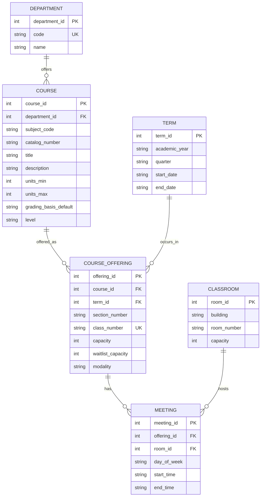
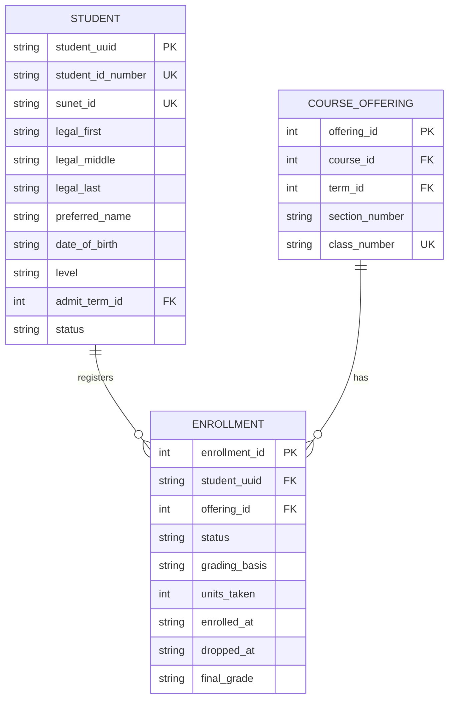
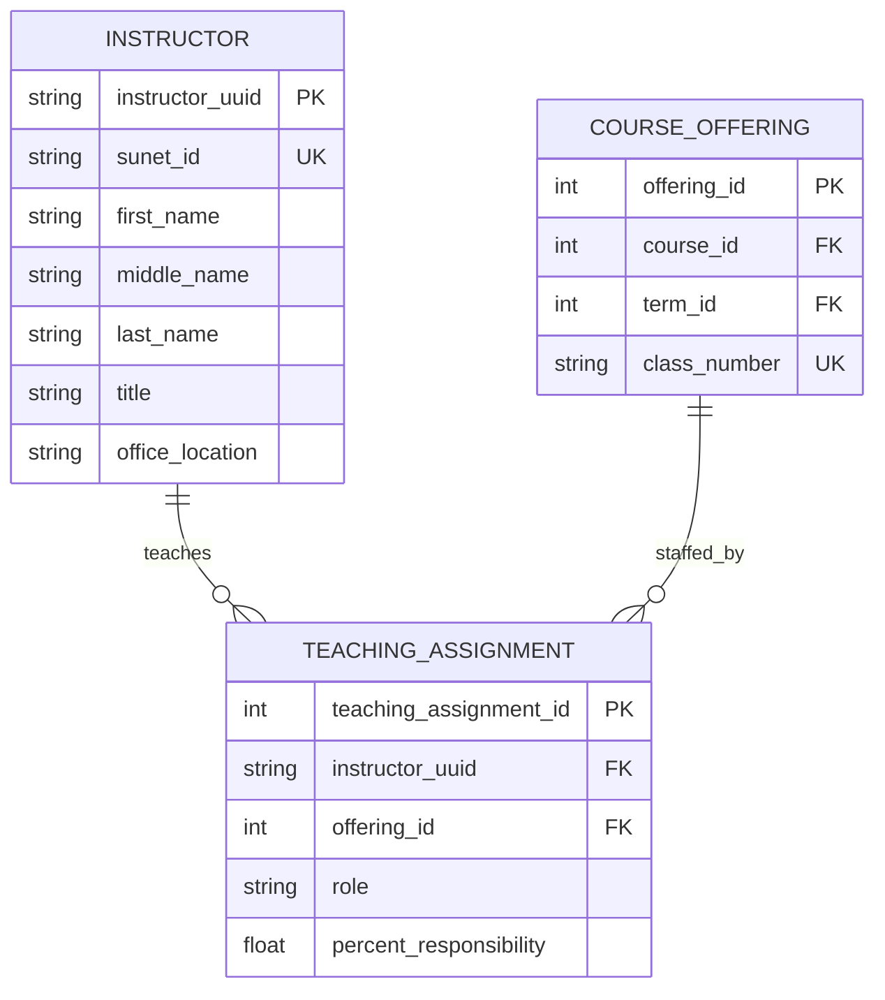
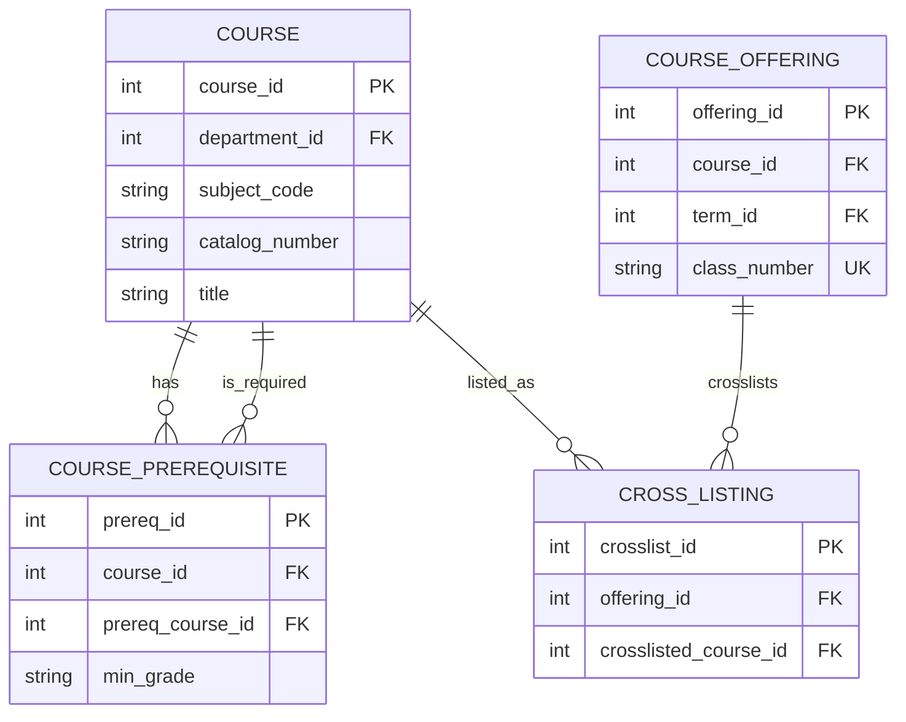
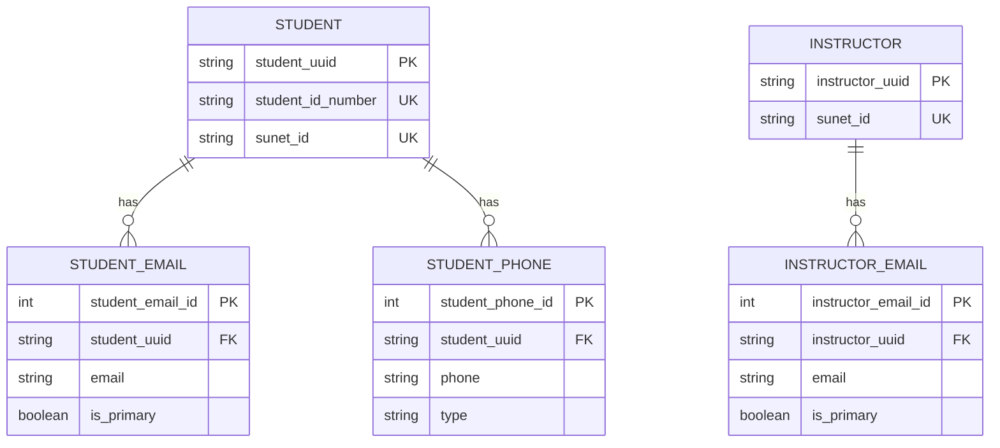

# University Course Management System — ERD (Stanford-style)

> Deliverable: Comprehensive ER diagram + conceptual/logical/physical modeling notes.
>
> Notes on “Stanford-style” assumptions used here:
> - People have **SUNet IDs** (campus login) and a separate **Student ID Number** (e.g., 8–10 digit) and/or internal **UUID**.
> - Courses have a stable catalog identity (**Course**) and are offered each term as **Course Offerings / Sections**.
> - Real-world needs include cross-listing, multiple instructors per offering, waitlists, and prerequisites.

---

## 1) Entities & Attributes (with attribute types)

Legend:
- **PK** = Primary Key
- **AK** = Alternate Key / Unique Identifier
- **(C)** = Composite attribute
- **(M)** = Multivalued attribute (modeled as separate entity/table)
- **(D)** = Derived attribute

### Core academic structure

#### Department
- **department_id (PK)**
- code (AK) — e.g., CS, MATH
- name
- chair_instructor_id (FK → Instructor, optional)

#### Course (Catalog Course)
- **course_id (PK)**
- department_id (FK → Department)
- subject_code (AK part) — e.g., CS
- catalog_number (AK part) — e.g., 106A
- title
- description
- units_min
- units_max
- grading_basis_default — e.g., Letter, S/NC
- level — UG/GR

**Candidate alternate key (AK):** (subject_code, catalog_number) within a catalog year.

#### Term
- **term_id (PK)**
- academic_year — e.g., 2025–2026
- quarter — Autumn/Winter/Spring/Summer
- start_date
- end_date

#### CourseOffering / Section
(An instance of a course taught in a specific term)
- **offering_id (PK)**
- course_id (FK → Course)
- term_id (FK → Term)
- section_number — e.g., 01
- class_number (AK) — registrar “Class #”
- capacity
- waitlist_capacity
- modality — in-person/online/hybrid
- **enrolled_count (D)** — count of active enrollments
- **waitlist_count (D)** — count of waitlisted enrollments

#### Classroom
- **room_id (PK)**
- building
- room_number
- capacity

#### Meeting
(When/where an offering meets; supports multiple meetings per offering)
- **meeting_id (PK)**
- offering_id (FK → CourseOffering)
- room_id (FK → Classroom, optional)
- day_of_week
- start_time
- end_time

### People

#### Student
- **student_uuid (PK)** — internal unique identifier (immutable)
- student_id_number (AK) — official student ID
- sunet_id (AK) — campus login
- legal_name (C) — {first, middle, last}
- preferred_name
- date_of_birth
- **age (D)** — from date_of_birth
- level — UG/GR
- admit_term_id (FK → Term, optional)
- status — active/leave/graduated

Multivalued attributes (modeled separately):
- emails (M) → StudentEmail
- phones (M) → StudentPhone

#### Instructor
- **instructor_uuid (PK)**
- sunet_id (AK)
- name (C) — {first, middle, last}
- title — Professor/Lecturer/TA/etc.
- office_location

Multivalued attributes:
- emails (M) → InstructorEmail

### Relationship-associative entities (resolve M:N and capture attributes)

#### Enrollment
(Associative entity between Student and CourseOffering)
- **enrollment_id (PK)**
- student_uuid (FK → Student)
- offering_id (FK → CourseOffering)
- status — enrolled / waitlisted / dropped
- grading_basis — chosen (may override default)
- units_taken
- enrolled_at
- dropped_at (optional)
- final_grade (optional)

Business rule: one active enrollment per (student, offering).

#### TeachingAssignment
(Associative entity between Instructor and CourseOffering)
- **teaching_assignment_id (PK)**
- instructor_uuid (FK → Instructor)
- offering_id (FK → CourseOffering)
- role — instructor_of_record / co-instructor / TA
- percent_responsibility (optional)

#### CoursePrerequisite
(Self-referential relationship on Course)
- **prereq_id (PK)**
- course_id (FK → Course) — the course that has prerequisites
- prereq_course_id (FK → Course) — the required course
- min_grade (optional)

#### CrossListing
(Optional, if you want Stanford-like cross-listed courses)
- **crosslist_id (PK)**
- offering_id (FK → CourseOffering)
- crosslisted_course_id (FK → Course)

### Multivalued attribute entities (examples)

#### StudentEmail
- **student_email_id (PK)**
- student_uuid (FK → Student)
- email
- is_primary

#### StudentPhone
- **student_phone_id (PK)**
- student_uuid (FK → Student)
- phone
- type — mobile/home/etc.

#### InstructorEmail
- **instructor_email_id (PK)**
- instructor_uuid (FK → Instructor)
- email
- is_primary

---

## 2) Conceptual, Logical, and Physical Model

### 2.1 Conceptual Model (high-level ER view)

**Entities:** Department, Course, Term, CourseOffering, Meeting, Classroom, Student, Instructor.

**Key Relationships (with cardinalities):**
- Department **1** — **N** Course
- Course **1** — **N** CourseOffering
- Term **1** — **N** CourseOffering
- CourseOffering **1** — **N** Meeting
- Classroom **1** — **N** Meeting (optional on Meeting for online)
- Student **M** — **N** CourseOffering (via Enrollment)
- Instructor **M** — **N** CourseOffering (via TeachingAssignment)
- Course **M** — **N** Course (via CoursePrerequisite, self-relationship)
- CourseOffering **M** — **N** Course (via CrossListing, optional)

**Attribute types explicitly used:**
- Composite: Student.legal_name, Instructor.name
- Multivalued: emails/phones (modeled as separate entities)
- Derived: Student.age, CourseOffering.enrolled_count/waitlist_count

### 2.2 Logical Model (relational design)

Tables (PK → primary key, FK → foreign key):
- Department(department_id PK, code UNIQUE, ...)
- Course(course_id PK, department_id FK, subject_code, catalog_number, ...)
  - UNIQUE(subject_code, catalog_number) (optionally scoped by catalog_year)
- Term(term_id PK, ...)
- CourseOffering(offering_id PK, course_id FK, term_id FK, class_number UNIQUE, ...)
- Classroom(room_id PK, ...)
- Meeting(meeting_id PK, offering_id FK, room_id FK NULL, ...)
- Student(student_uuid PK, student_id_number UNIQUE, sunet_id UNIQUE, ...)
- Instructor(instructor_uuid PK, sunet_id UNIQUE, ...)
- Enrollment(enrollment_id PK, student_uuid FK, offering_id FK, ...)
  - UNIQUE(student_uuid, offering_id) for “one record per student per offering”
- TeachingAssignment(teaching_assignment_id PK, instructor_uuid FK, offering_id FK, ...)
  - UNIQUE(instructor_uuid, offering_id, role) recommended
- CoursePrerequisite(prereq_id PK, course_id FK, prereq_course_id FK, ...)
  - prevent (course_id = prereq_course_id)
- CrossListing(crosslist_id PK, offering_id FK, crosslisted_course_id FK, ...)
- StudentEmail(student_email_id PK, student_uuid FK, ...)
- StudentPhone(student_phone_id PK, student_uuid FK, ...)
- InstructorEmail(instructor_email_id PK, instructor_uuid FK, ...)

**M:N relationships are resolved** using associative entities:
- Student↔Offering via Enrollment
- Instructor↔Offering via TeachingAssignment

### 2.3 Physical Model (implementation-oriented decisions; no DDL requested)

If implemented in a production university environment (typical Stanford-like constraints):
- Use **UUID** (student_uuid/instructor_uuid) as immutable PKs (safe for merges, privacy).
- Enforce **unique constraints** on:
  - Student.student_id_number
  - Student.sunet_id
  - Instructor.sunet_id
  - CourseOffering.class_number
- Add **indexes** on all FKs (student_uuid, offering_id, course_id, term_id, department_id).
- Use **soft-delete/status fields** for Enrollment (dropped vs deleted) to preserve auditability.
- Derived attributes (age, enrolled_count) should be **computed** (views/materialized views) rather than stored, unless performance needs justify caching.

---

## 3) ER Diagrams (Mermaid) — split to compile cleanly

The Mermaid skill you added recommends keeping diagrams readable (≤15 entities). So the ERD is split into focused views. Each diagram compiles in GitHub Mermaid.

### 3.1 Core Catalog & Scheduling (Department → Course → Offering → Meetings)

### 3.2 Student Enrollment (Student ↔ Offering)

### 3.3 Teaching Assignments (Instructor ↔ Offering)

### 3.4 Curriculum Rules (Prerequisites + Cross-Listing)

### 3.5 Multivalued Contact Attributes (modeled as entities)

---

## Quick checks vs requirements

- **Entities + Attributes identified** (incl. derived + multivalued + composite) ✅
- **Conceptual + Logical + Physical models** included (no SQL schema as requested) ✅
- **ER diagrams** provided in Mermaid and split for reliable GitHub rendering ✅

