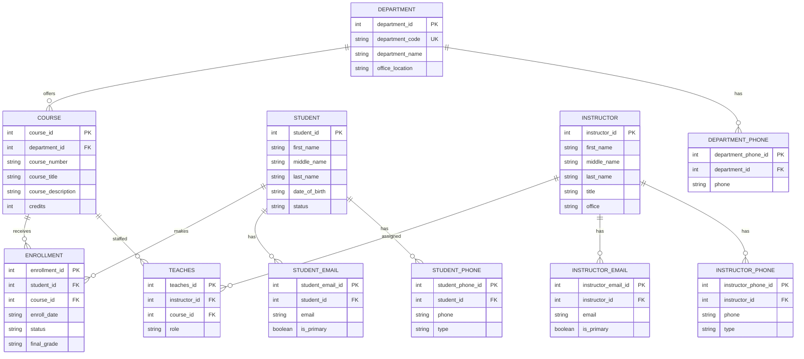

# University Course Management System — ERD (Revised to match scenario naming)
---

## 1) Entities & Attributes (with attribute types)

Legend:
- **PK** = Primary Key
- **FK** = Foreign Key
- **UK** = Unique / Alternate Key
- **(C)** = Composite attribute
- **(M)** = Multivalued attribute *(modeled as separate relation)*
- **(D)** = Derived attribute

### 1.1 Core entities (as required by the scenario)

<table style="width: 100%; table-layout: fixed;">
  <thead>
    <tr>
      <th style="width: 18%;">Entity</th>
      <th style="width: 16%;">Primary Key</th>
      <th style="width: 22%;">Other keys</th>
      <th style="width: 30%;">Selected attributes</th>
      <th style="width: 14%;">Notes (C/M/D)</th>
    </tr>
  </thead>
  <tbody>
    <tr>
      <td>DEPARTMENT</td>
      <td>department_id</td>
      <td>department_code (UK)</td>
      <td>department_name, office_location</td>
      <td>phones (M)</td>
    </tr>
    <tr>
      <td>COURSE</td>
      <td>course_id</td>
      <td>(department_id, course_number) (UK)</td>
      <td>course_title, course_description, credits</td>
      <td>—</td>
    </tr>
    <tr>
      <td>STUDENT</td>
      <td>student_id</td>
      <td>email (UK) (optional)</td>
      <td>first_name, middle_name, last_name, date_of_birth, status</td>
      <td>name (C), age (D), emails (M), phones (M)</td>
    </tr>
    <tr>
      <td>INSTRUCTOR</td>
      <td>instructor_id</td>
      <td>email (UK) (optional)</td>
      <td>first_name, middle_name, last_name, title, office</td>
      <td>name (C), emails (M), phones (M)</td>
    </tr>
    <tr>
      <td>ENROLLMENT</td>
      <td>enrollment_id</td>
      <td>(student_id, course_id) (UK)</td>
      <td>enroll_date, status, final_grade</td>
      <td>M:N resolution</td>
    </tr>
  </tbody>
</table>

### 1.2 Relationships (cardinalities)

<table style="width: 100%; table-layout: fixed;">
  <thead>
    <tr>
      <th style="width: 44%;">Relationship</th>
      <th style="width: 28%;">Cardinality</th>
      <th style="width: 28%;">How it’s modeled</th>
    </tr>
  </thead>
  <tbody>
    <tr>
      <td>DEPARTMENT offers COURSE</td>
      <td>DEPARTMENT 1 — N COURSE</td>
      <td>COURSE.department_id is an FK</td>
    </tr>
    <tr>
      <td>STUDENT enrolls in COURSE</td>
      <td>STUDENT M — N COURSE</td>
      <td>Associative entity ENROLLMENT</td>
    </tr>
    <tr>
      <td>INSTRUCTOR teaches COURSE</td>
      <td>INSTRUCTOR M — N COURSE</td>
      <td>Associative entity TEACHES (see below)</td>
    </tr>
  </tbody>
</table>

### 1.3 Associative entities (M:N resolution)

#### TEACHES (Instructor ↔ Course)

<table style="width: 100%; table-layout: fixed;">
  <thead>
    <tr>
      <th style="width: 20%;">Field</th>
      <th style="width: 80%;">Value</th>
    </tr>
  </thead>
  <tbody>
    <tr>
      <td>PK</td>
      <td>teaches_id</td>
    </tr>
    <tr>
      <td>FKs</td>
      <td>instructor_id → INSTRUCTOR course_id → COURSE</td>
    </tr>
    <tr>
      <td>Attributes</td>
      <td>role (e.g., primary/co-instructor/TA)</td>
    </tr>
    <tr>
      <td>Rule</td>
      <td>UNIQUE(instructor_id, course_id, role) (recommended)</td>
    </tr>
  </tbody>
</table>

### 1.4 Multivalued attribute relations (examples)

<table style="width: 100%; table-layout: fixed;">
  <thead>
    <tr>
      <th style="width: 22%;">Relation</th>
      <th style="width: 18%;">PK</th>
      <th style="width: 24%;">FK</th>
      <th style="width: 36%;">Attributes</th>
    </tr>
  </thead>
  <tbody>
    <tr>
      <td>STUDENT_EMAIL</td>
      <td>student_email_id</td>
      <td>student_id → STUDENT</td>
      <td>email, is_primary</td>
    </tr>
    <tr>
      <td>STUDENT_PHONE</td>
      <td>student_phone_id</td>
      <td>student_id → STUDENT</td>
      <td>phone, type</td>
    </tr>
    <tr>
      <td>INSTRUCTOR_EMAIL</td>
      <td>instructor_email_id</td>
      <td>instructor_id → INSTRUCTOR</td>
      <td>email, is_primary</td>
    </tr>
    <tr>
      <td>INSTRUCTOR_PHONE</td>
      <td>instructor_phone_id</td>
      <td>instructor_id → INSTRUCTOR</td>
      <td>phone, type</td>
    </tr>
    <tr>
      <td>DEPARTMENT_PHONE</td>
      <td>department_phone_id</td>
      <td>department_id → DEPARTMENT</td>
      <td>phone</td>
    </tr>
  </tbody>
</table>

---

## 2) Conceptual, Logical, and Physical Model

### 2.1 Conceptual Model (high-level)

<table style="width: 100%; table-layout: fixed;">
  <thead>
    <tr>
      <th style="width: 20%;">Item</th>
      <th style="width: 80%;">Details</th>
    </tr>
  </thead>
  <tbody>
    <tr>
      <td>Entities</td>
      <td>DEPARTMENT, COURSE, STUDENT, INSTRUCTOR, ENROLLMENT</td>
    </tr>
    <tr>
      <td>Relationships</td>
      <td>
        DEPARTMENT 1—N COURSE (a department offers many courses) 
        STUDENT M—N COURSE via ENROLLMENT (students enroll in many courses; courses have many students) 
        INSTRUCTOR M—N COURSE via TEACHES (instructors teach many courses; courses may have multiple instructors)
      </td>
    </tr>
    <tr>
      <td>Attribute types shown</td>
      <td>
        Composite: STUDENT.name, INSTRUCTOR.name 
        Multivalued: emails/phones (modeled using *_EMAIL and *_PHONE relations) 
        Derived: STUDENT.age derived from date_of_birth
      </td>
    </tr>
  </tbody>
</table>

### 2.2 Logical Model (relational schema)

<table style="width: 100%; table-layout: fixed;">
  <thead>
    <tr>
      <th style="width: 16%;">Table</th>
      <th style="width: 16%;">Primary Key</th>
      <th style="width: 34%;">Foreign Keys</th>
      <th style="width: 34%;">Key constraints / notes</th>
    </tr>
  </thead>
  <tbody>
    <tr>
      <td>DEPARTMENT</td>
      <td>department_id</td>
      <td>—</td>
      <td>department_code UNIQUE</td>
    </tr>
    <tr>
      <td>COURSE</td>
      <td>course_id</td>
      <td>department_id → DEPARTMENT</td>
      <td>(department_id, course_number) UNIQUE</td>
    </tr>
    <tr>
      <td>STUDENT</td>
      <td>student_id</td>
      <td>—</td>
      <td>email UNIQUE (optional policy)</td>
    </tr>
    <tr>
      <td>INSTRUCTOR</td>
      <td>instructor_id</td>
      <td>—</td>
      <td>email UNIQUE (optional policy)</td>
    </tr>
    <tr>
      <td>ENROLLMENT</td>
      <td>enrollment_id</td>
      <td>student_id → STUDENT; course_id → COURSE</td>
      <td>(student_id, course_id) UNIQUE</td>
    </tr>
    <tr>
      <td>TEACHES</td>
      <td>teaches_id</td>
      <td>instructor_id → INSTRUCTOR; course_id → COURSE</td>
      <td>(instructor_id, course_id, role) UNIQUE (recommended)</td>
    </tr>
    <tr>
      <td>STUDENT_EMAIL</td>
      <td>student_email_id</td>
      <td>student_id → STUDENT</td>
      <td>student can have many emails</td>
    </tr>
    <tr>
      <td>STUDENT_PHONE</td>
      <td>student_phone_id</td>
      <td>student_id → STUDENT</td>
      <td>student can have many phones</td>
    </tr>
    <tr>
      <td>INSTRUCTOR_EMAIL</td>
      <td>instructor_email_id</td>
      <td>instructor_id → INSTRUCTOR</td>
      <td>instructor can have many emails</td>
    </tr>
    <tr>
      <td>INSTRUCTOR_PHONE</td>
      <td>instructor_phone_id</td>
      <td>instructor_id → INSTRUCTOR</td>
      <td>instructor can have many phones</td>
    </tr>
    <tr>
      <td>DEPARTMENT_PHONE</td>
      <td>department_phone_id</td>
      <td>department_id → DEPARTMENT</td>
      <td>department can have many phones</td>
    </tr>
  </tbody>
</table>

### 2.3 Physical Model (implementation-oriented notes; no DDL required)

<table style="width: 100%; table-layout: fixed;">
  <thead>
    <tr>
      <th style="width: 22%;">Concern</th>
      <th style="width: 38%;">Recommendation</th>
      <th style="width: 40%;">Why</th>
    </tr>
  </thead>
  <tbody>
    <tr>
      <td>Primary keys</td>
      <td>Use integer surrogate keys: student_id, instructor_id, course_id, department_id</td>
      <td>Simple, matches typical “Course/Student/Instructor ID” expectations in coursework</td>
    </tr>
    <tr>
      <td>FK indexing</td>
      <td>Index all foreign keys (COURSE.department_id, ENROLLMENT.student_id, ENROLLMENT.course_id, TEACHES.instructor_id, TEACHES.course_id)</td>
      <td>Improves join performance</td>
    </tr>
    <tr>
      <td>Derived attributes</td>
      <td>Do not store STUDENT.age; compute from date_of_birth</td>
      <td>Avoids stale/incorrect ages</td>
    </tr>
    <tr>
      <td>Enrollment integrity</td>
      <td>Enforce UNIQUE(student_id, course_id) in ENROLLMENT</td>
      <td>Prevents duplicate enrollments for the same student/course pair</td>
    </tr>
  </tbody>
</table>

---

## 3) ER Diagram (Mermaid)

